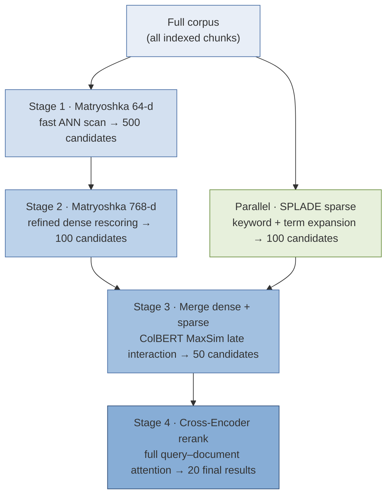

# The Retrieval Funnel — Multi-Embedding Retrieval Pipeline

<center>

</center>

This lab demonstrates a **retrieval funnel**: a multi-stage search pipeline that starts with a very fast, coarse retrieval over the whole corpus and progressively narrows the candidate set with increasingly accurate (and increasingly expensive) scoring methods, until a small, precisely-ranked set of results remains.

The entire lab is driven by a single notebook:

> **[`docs/notebooks/retrieval_funnel.ipynb`](docs/notebooks/retrieval_funnel.ipynb)**

which combines four retrieval technologies — **Matryoshka embeddings**, **SPLADE sparse embeddings**, **ColBERT late-interaction embeddings**, and a **cross-encoder reranker** — into one hybrid pipeline backed by a [Qdrant](https://qdrant.tech) vector database.



A much more detailed treatment of the pipeline — with stage-by-stage diagrams, the Qdrant collection design, and the cost/precision trade-offs — is in the **[Architecture Document](docs/architecture.md)**.

---

## Concept Guides

Four of the techniques in this lab appear here for the first time in the bootcamp. Each has a dedicated explanatory document:

| Concept | Document | What it covers |
|---|---|---|
| Retrieval funnel philosophy | [`docs/concepts/retrieval_funnel_philosophy.md`](docs/concepts/retrieval_funnel_philosophy.md) | Why retrieval is staged as a funnel; why we run keyword and semantic retrieval in parallel and then merge and rerank |
| Matryoshka embeddings | [`docs/concepts/matryoshka_embeddings.md`](docs/concepts/matryoshka_embeddings.md) | How embeddings are trained so their leading dimensions carry most of the information, enabling cheap truncated-vector search followed by full-dimension refinement |
| ColBERT embeddings | [`docs/concepts/colbert_embeddings.md`](docs/concepts/colbert_embeddings.md) | Token-level "late interaction" matching between query and document, and how ColBERT is trained |
| SPLADE embeddings | [`docs/concepts/splade_embeddings.md`](docs/concepts/splade_embeddings.md) | Learned sparse lexical embeddings, and why they often beat BM25 |
| Cross-encoder reranking | [`docs/concepts/cross_encoder_reranking.md`](docs/concepts/cross_encoder_reranking.md) | Why cross-encoders are the gold standard for relevance scoring, and why they belong at the very end of the pipeline |

---

## Prerequisites

Before setting up, make sure you have:

1. **Python 3.12** — the project pins `requires-python >= 3.12` (see `.python-version`).
2. **[uv](https://docs.astral.sh/uv/)** — the package/environment manager used for all SupportVectors labs.
3. **Docker** (or Podman) — the notebook connects to a Qdrant server at `localhost:6333`.
4. **An IDE that can run Jupyter notebooks** — Cursor or VS Code (with the Jupyter extension) is recommended.
5. Roughly **4–5 GB of free disk** for the virtual environment and the Hugging Face models that are downloaded on first run.

A GPU is *not* required: the notebook automatically selects `cuda` if available, otherwise Apple-Silicon `mps`, otherwise `cpu`.

---

## Setup

### 1. Create the virtual environment with `uv sync`

From the root folder of this project (`retrieval_funnel/`):

```bash
uv sync
```

This reads `pyproject.toml` and `uv.lock`, creates a `.venv/` virtual environment with Python 3.12, and installs all pinned dependencies (`sentence-transformers`, `fastembed`, `qdrant-client`, `datasets`, and the SupportVectors `svlearn-bootcamp` library).

### 2. Point `config.yaml` at the project root

Open `config.yaml` and set `paths.data_dir` to the **absolute path of the root folder of this project on your machine**:

```yaml
cohort: Spring 2025
paths:
  data_dir: /absolute/path/to/retrieval_funnel
```

The data-loading utilities look for the corpus at `{data_dir}/chunks/*.json`, so `data_dir` must be the folder that *contains* the `chunks/` directory — i.e. this project's root.

### 3. Create your `.env` from `.env.example`

```bash
cp .env.example .env
```

Then edit `.env` and update every path to match your machine:

| Variable | What to set it to |
|---|---|
| `BOOTCAMP_ROOT_DIR` | Absolute path of this project's root folder (the same folder as in `config.yaml`). The `svlearn` configuration loader uses this to locate `config.yaml`. |
| `PROJECT_PYTHON` | `<project-root>/.venv/bin/python` — the interpreter created by `uv sync` |
| `PYTHONPATH` | `<project-root>/src` — so the `retrieval_funnel` package resolves in the notebook |
| `OPENAI_API_KEY` | Your OpenAI key (not needed by this particular notebook; safe to leave as a placeholder) |

The notebook loads this file automatically: importing `retrieval_funnel` calls `load_dotenv()` and then reads `config.yaml`.

### 4. Start the Qdrant server

The notebook expects a Qdrant instance listening on `localhost:6333`:

```bash
docker run -d --name qdrant -p 6333:6333 -p 6334:6334 \
    -v "$(pwd)/qdrant_storage:/qdrant/storage" \
    qdrant/qdrant
```

You can verify it is up by opening the Qdrant dashboard at [http://localhost:6333/dashboard](http://localhost:6333/dashboard).

### 5. Make sure the corpus is present

The `chunks/` folder in the project root must contain the JSONL chunk files (Biology, Physics, and History text chunks). These ship with the lab; if the folder is empty, ask the instructors for the data drop.

### 6. Open the notebook in your IDE and run it

1. Open the **project root folder** in Cursor (or VS Code).
2. Open `docs/notebooks/retrieval_funnel.ipynb`.
3. When prompted for a kernel, select the project's virtual environment: `.venv/bin/python` (it may be displayed as `retrieval-funnel` or `.venv`).
4. Run the cells from top to bottom.

> **Note:** the first cell executes `%run supportvectors-common.ipynb`, which lives next to the notebook — so the notebook must be run from its own folder (IDEs do this automatically). On first execution, the four Hugging Face models are downloaded (~1.5 GB total); subsequent runs use the local cache.

---

## What the Notebook Demonstrates

The notebook builds and exercises a complete hybrid retrieval funnel over a corpus of textbook chunks drawn from three subjects — **Biology**, **Physics**, and **History**.

### 1. Data preparation

Using `src/retrieval_funnel/hf_text_utils.py`, the JSONL chunk files are loaded, filtered (chunks shorter than 100 characters are dropped), shuffled, and split 80/20; the notebook indexes the *test* split. Each chunk carries a subject label (`Biology=0`, `Physics=1`, `History=2`) that is stored as payload metadata and used later to sanity-check retrieval quality.

### 2. Model initialization

Four models, one per retrieval technique:

| Role | Model | Type |
|---|---|---|
| Coarse + refined dense retrieval | `tomaarsen/mpnet-base-nli-matryoshka` | Matryoshka sentence embedding (768-d, also loaded with `truncate_dim=64`) |
| Sparse lexical retrieval | `prithivida/Splade_PP_en_v1` | SPLADE sparse embedding (via `fastembed`) |
| Late-interaction rescoring | `colbert-ir/colbertv2.0` | ColBERT multi-vector embedding (128-d per token, via `fastembed`) |
| Final reranking | `cross-encoder/ms-marco-MiniLM-L6-v2` | Cross-encoder |

### 3. A single hybrid Qdrant collection

One collection (`hybrid_search`) holds **four named vector types per document**: `matryoshka_64` (64-d, cosine), `matryoshka_768` (768-d, cosine), `colbert` (multi-vector with `MAX_SIM` comparator, HNSW disabled since it is only used for rescoring), and `splade` (sparse, with IDF modifier). Every chunk is embedded four ways and uploaded once, with its text and subject as payload.

### 4. The multi-stage retrieval pipeline

The heart of the lab: a `MultiEmbeddingRetrievalPipelineQdrant` class that expresses the entire funnel as **nested Qdrant `prefetch` queries**, executed server-side in a single round trip:

1. **Matryoshka 64-d** ANN search retrieves **500** candidates — very fast, in a 12×-smaller vector space.
2. **Matryoshka 768-d** rescoring of those 500 narrows them to **100** — same model, full precision.
3. **SPLADE** sparse retrieval runs **in parallel**, contributing its own **100** keyword-matched candidates.
4. The dense and sparse branches are **merged**, and **ColBERT MaxSim** late interaction rescores the union down to **50**.
5. The **cross-encoder** reads each of the 50 query–document pairs jointly and produces the final ranked **20** results.

### 5. Testing and performance analysis

The pipeline is exercised with test queries spanning all three subjects ("What is the relationship between force and acceleration?", "How do vaccines work in the human body?", …), and a final section times the hybrid-search stage versus the cross-encoder stage — making the funnel's core trade-off (cheap-and-broad vs. expensive-and-precise) directly visible.

---

## Project Layout

```
retrieval_funnel/
├── README.md                  ← this file
├── pyproject.toml             ← project dependencies (managed by uv)
├── uv.lock                    ← pinned dependency versions
├── config.yaml                ← paths configuration (edit data_dir!)
├── .env.example               ← template for your .env (edit the paths!)
├── chunks/                    ← corpus: JSONL text chunks for the three subjects
├── docs/
│   ├── architecture.md        ← detailed architecture doc with diagrams
│   ├── concepts/              ← per-concept explanatory documents
│   │   ├── retrieval_funnel_philosophy.md
│   │   ├── matryoshka_embeddings.md
│   │   ├── colbert_embeddings.md
│   │   ├── splade_embeddings.md
│   │   └── cross_encoder_reranking.md
│   └── notebooks/
│       ├── retrieval_funnel.ipynb      ← ★ the lab notebook
│       └── supportvectors-common.ipynb ← shared styling/setup (run by the first cell)
└── src/
    └── retrieval_funnel/
        ├── __init__.py        ← loads .env and config.yaml into `config`
        └── hf_text_utils.py   ← data loading/splitting utilities used by the notebook
```

---

## Troubleshooting

- **`Connection refused` on port 6333** — the Qdrant container is not running; re-run the `docker run` command from step 4 (or `docker start qdrant`).
- **`FileNotFoundError` / zero chunks loaded** — `data_dir` in `config.yaml` does not point to the project root, or the `chunks/` folder is missing.
- **`ModuleNotFoundError: retrieval_funnel`** — the notebook kernel is not the `.venv` interpreter, or `PYTHONPATH` in `.env` does not point to `<project-root>/src`.
- **Slow first run** — model downloads and the embedding-generation loop dominate the first execution; subsequent runs reuse the Hugging Face cache and the populated Qdrant collection. (If you re-run the collection-creation cell, the collection is recreated and must be re-populated.)
- **CUDA issues on Linux** — see `docs/project-guide/tips-and-tricks/cuda-hell.md`.
