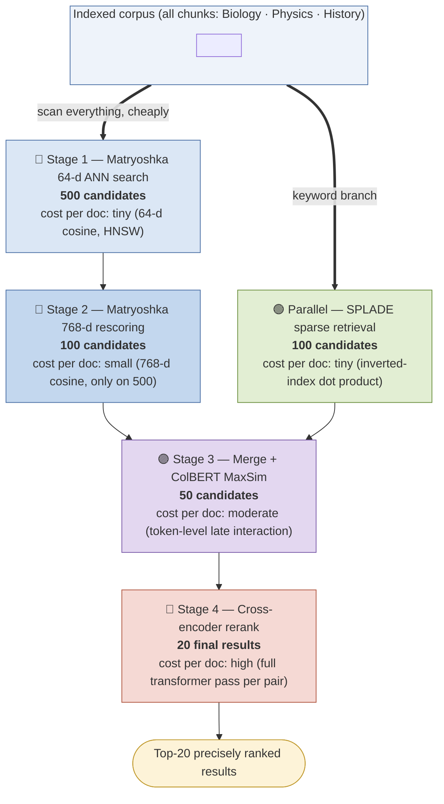
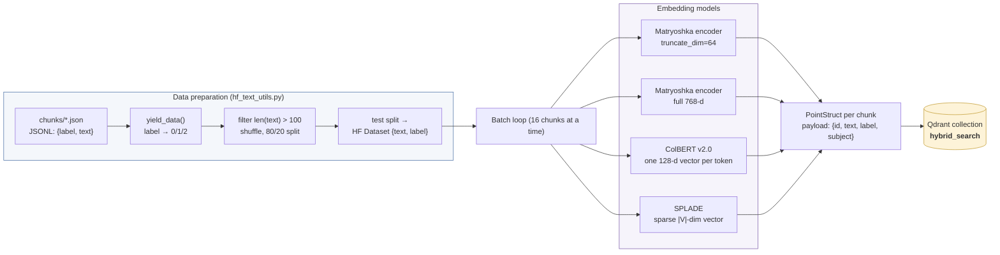
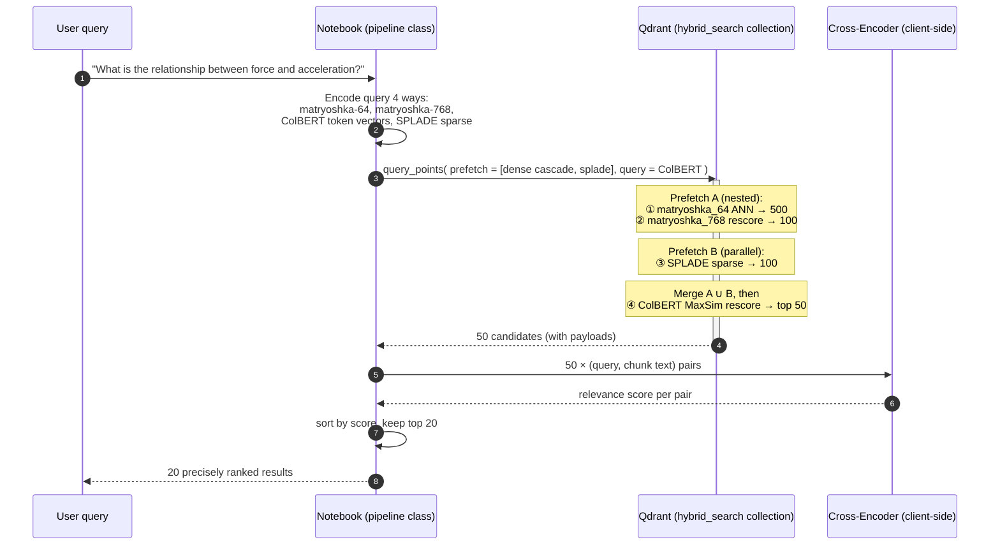
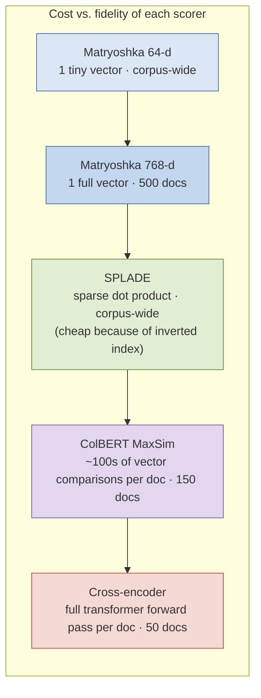
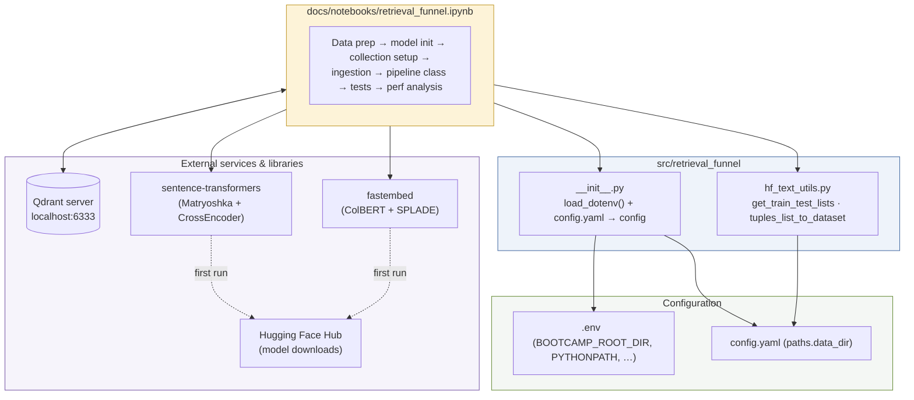

# Architecture: The Retrieval Funnel

This document describes the architecture of the multi-embedding retrieval pipeline implemented in [`notebooks/retrieval_funnel.ipynb`](notebooks/retrieval_funnel.ipynb). It covers the funnel design, the ingestion (indexing) path, the query path, the Qdrant collection layout, and the reasoning behind each stage.

For deeper dives into the individual techniques, see the concept guides:
[Retrieval-funnel philosophy](concepts/retrieval_funnel_philosophy.md) ·
[Matryoshka embeddings](concepts/matryoshka_embeddings.md) ·
[ColBERT embeddings](concepts/colbert_embeddings.md) ·
[SPLADE embeddings](concepts/splade_embeddings.md) ·
[Cross-encoder reranking](concepts/cross_encoder_reranking.md)

---

## 1. The Big Picture: A Funnel, Not a Single Search

Every retrieval method sits somewhere on a spectrum between *cheap-but-coarse* and *expensive-but-precise*. No single method is both fast enough to scan an entire corpus and accurate enough to produce a trustworthy final ranking. The funnel resolves this tension by **chaining methods in order of increasing cost and increasing accuracy**, letting each stage operate only on the survivors of the previous one:



Reading the funnel top to bottom:

- **Breadth first.** Stage 1 touches (in principle) the entire corpus, so it must be extremely cheap per document. Truncated 64-dimensional Matryoshka vectors make the ANN index a fraction of the full-dimensional size and each distance computation ~12× cheaper than at 768-d.
- **Two independent recall paths.** Dense (semantic) retrieval and sparse (lexical) retrieval fail in different ways, so the funnel runs them **in parallel** and merges their candidates — the classic *hybrid search* pattern. A rare drug name or an exact code identifier that a dense embedding blurs will be caught by SPLADE; a paraphrase with no keyword overlap will be caught by the dense branch.
- **Precision last.** ColBERT and the cross-encoder are far too expensive to run over the whole corpus, but they are the most faithful judges of relevance. They only ever see 150 and 50 documents respectively, so their cost is bounded and independent of corpus size.

The numbers 500 → 100 → (+100) → 50 → 20 are the notebook's defaults (`matryoshka_64_limit`, `matryoshka_768_limit`, `splade_limit`, `colbert_limit`, `cross_encoder_limit`) and are all tunable knobs of the `hybrid_search` / `retrieve` methods.

---

## 2. Ingestion Path (Indexing)

Before any query can be served, every chunk is embedded **four different ways** and stored in a *single* Qdrant collection under named vectors:



### The Qdrant collection layout

One collection, four vector spaces per point — this is what makes single-round-trip hybrid search possible:

| Named vector | Type | Size | Distance / scoring | Notes |
|---|---|---|---|---|
| `matryoshka_64` | dense | 64 | Cosine | HNSW-indexed; powers the cheap first pass |
| `matryoshka_768` | dense | 768 | Cosine | HNSW-indexed; refines the first pass |
| `colbert` | **multi-vector** (one per token) | 128 × #tokens | `MAX_SIM` comparator | `hnsw_config(m=0)` — **HNSW disabled**, because ColBERT is used only to *rescore* prefetched candidates, never to search the whole corpus |
| `splade` | **sparse** | vocabulary-sized, mostly zeros | dot product with `Modifier.IDF` | inverted-index style lexical matching with learned term weights |

Every point also carries a payload `{id, text, label, subject}`, so the final results can be displayed and analyzed by subject without a second lookup.

> **Design point:** disabling HNSW on the ColBERT vectors (`m=0`) is deliberate. Multi-vector MaxSim comparisons are expensive and the funnel never needs to run them corpus-wide — only over the merged candidates delivered by the prefetch stages. Turning the index off saves a large amount of indexing time and memory.

---

## 3. Query Path

At query time the funnel is expressed as **nested Qdrant `prefetch` clauses**, so the whole dense-cascade + sparse-branch + ColBERT-rescore executes **server-side in one `query_points` call**; only the cross-encoder runs client-side afterwards:



The nesting structure in code mirrors the funnel exactly:

```python
prefetch_matryoshka_64  = Prefetch(query=q64,  using="matryoshka_64",  limit=500)
prefetch_matryoshka_768 = Prefetch(query=q768, using="matryoshka_768", limit=100,
                                   prefetch=prefetch_matryoshka_64)      # ← nested: refines stage 1
prefetch_splade         = Prefetch(query=q_sparse, using="splade", limit=100)

response = client.query_points(
    collection_name="hybrid_search",
    prefetch=[prefetch_matryoshka_768, prefetch_splade],  # ← merged branches
    query=q_colbert, using="colbert", limit=50,           # ← late-interaction rescore
)
```

An inner `prefetch` produces the candidate pool that its enclosing query is allowed to rescore — which is precisely the funnel semantics: *each stage only ever ranks the survivors of the stage below it.*

---

## 4. Why Each Stage Is Where It Is

The funnel's ordering follows a single principle: **per-document cost must rise only as the number of documents falls.**



| Stage | Representation interaction | What it can "see" | What it misses |
|---|---|---|---|
| Matryoshka 64-d | single-vector cosine | broad topical similarity | fine distinctions, exact terms |
| Matryoshka 768-d | single-vector cosine | full sentence-level semantics | word-level alignment, rare terms |
| SPLADE | sparse term overlap (expanded) | exact & related keywords, weighted by learned importance | pure paraphrase without lexical bridge |
| ColBERT | token-to-token MaxSim ("late interaction") | word-level alignment between query and document | full joint reasoning across the pair |
| Cross-encoder | full joint attention over (query ⧺ document) | everything — negation, word order, subtle relevance | nothing, but ~ms-per-pair cost |

Two structural choices deserve emphasis:

1. **The dense cascade (64 → 768) is the Matryoshka trick.** Because Matryoshka-trained embeddings pack most of their information into the leading coordinates, the 64-d prefix of the *same* vector is a faithful low-resolution proxy. Searching in 64-d and refining in 768-d gives near-full-precision recall at a fraction of the ANN cost. Details: [Matryoshka embeddings](concepts/matryoshka_embeddings.md).
2. **Sparse and dense are complementary, not redundant.** SPLADE's branch is not a "backup" — it systematically retrieves a *different* slice of relevant documents (exact terminology, rare entities) than the dense branch (paraphrases, concepts). Merging both before the precision stages is what makes the funnel *hybrid*. Details: [Retrieval-funnel philosophy](concepts/retrieval_funnel_philosophy.md).

---

## 5. Module & Dependency View



---

## 6. Tuning Knobs and Extensions

The funnel is intentionally parameterized so class discussion can explore the trade-off space:

- **Stage widths** (`500/100/100/50/20`): widening early stages raises recall at modest cost; widening late stages raises cost quickly. A useful classroom exercise is to shrink `matryoshka_64_limit` until relevant documents start falling out of the funnel — the failure is *unrecoverable downstream*, which is the key lesson: **a funnel can only lose recall after stage 1, never regain it.**
- **`use_cross_encoder=False`**: the `retrieve` method can stop at ColBERT, letting you compare the final ordering with and without the reranker.
- **Fusion alternatives**: the notebook merges branches by letting ColBERT rescore the union. An alternative shown in the Qdrant documentation is Reciprocal Rank Fusion (RRF) — a good discussion point for when no strong reranker is available.
- **The performance-analysis section** times hybrid search vs. cross-encoding, making the cost asymmetry concrete: the reranker typically dominates latency despite scoring only 50 documents.
