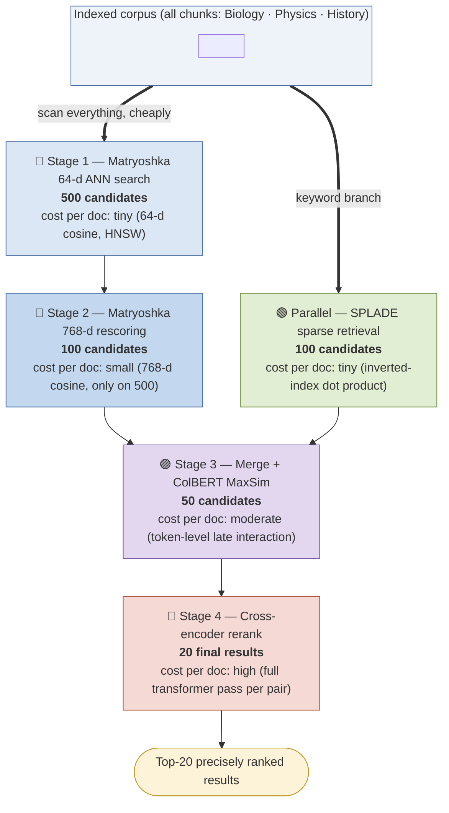
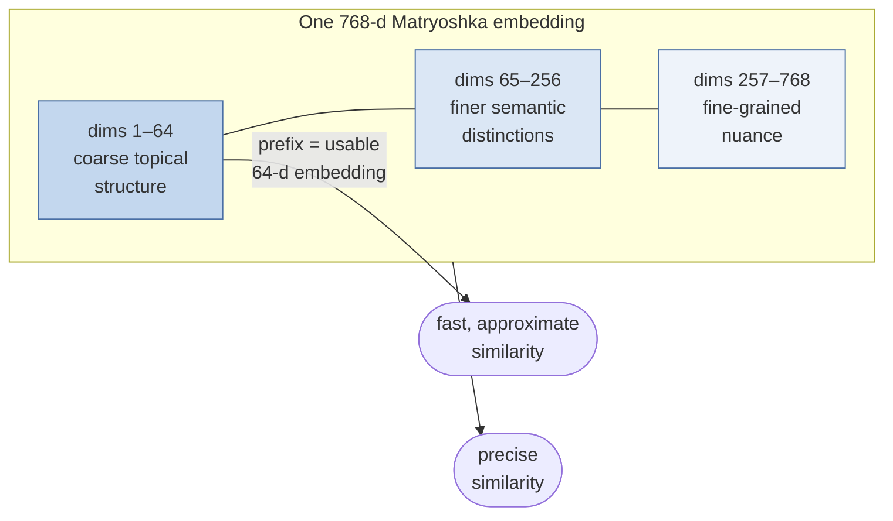
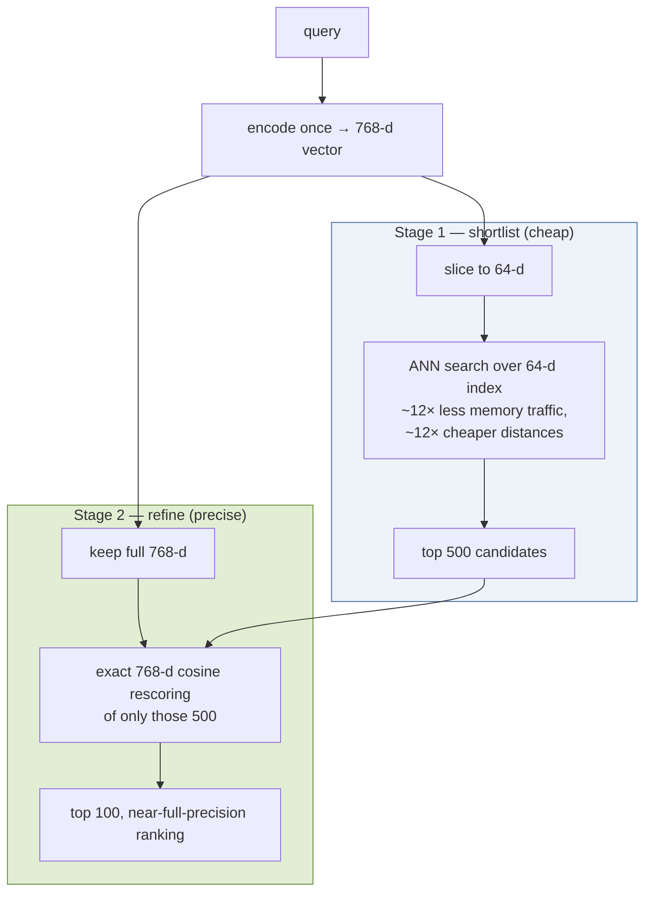
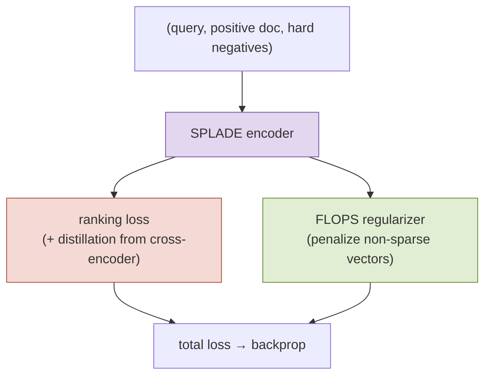
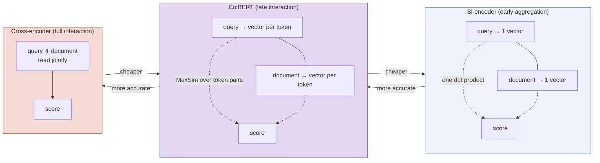
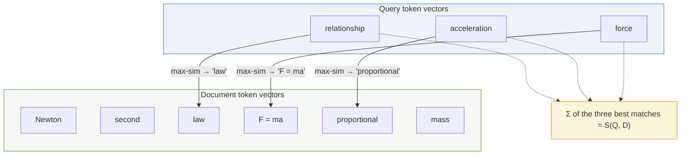

# Retrieval Funnel: Component Architecture Breakdown

This document provides a component-by-component architectural breakdown of the retrieval funnel pipeline implemented in this project.

---

## 📋 Stage 0: The Retrieval Funnel Big Picture

The retrieval funnel chains different models in order of **increasing per-document cost and accuracy**. By executing nested server-side Qdrant `prefetch` queries, it retrieves the bulk of the corpus cheaply, merges semantic and lexical search paths, and performs high-fidelity ranking at the very end.

### Key Funnel Design Principles:
1. **Resource Conservation**: We avoid passing all documents through expensive models (like Cross-Encoders or ColBERT).
2. **Parallel Hybrid Recall**: Dense (Matryoshka) and Sparse (SPLADE) retrieval run in parallel to capture both conceptual semantics and exact terms.
3. **Early Stage Recall Priority**: Early stages focus strictly on high recall, while later stages optimize for precision.

---

## 🧸 Component 1: Matryoshka Representation Learning (MRL)

Matryoshka embeddings are trained so that their leading dimensions carry the coarsest, most important semantic structure, while subsequent dimensions add finer details. This allows us to perform a very fast Approximate Nearest Neighbor (ANN) search over small 64-d vectors, and then refine only the top 500 candidates using the full 768-d vectors.

### Vector Structure & Trait Aggregation

### The Query-Time Cascade

### Why it works:
During training, the loss function is evaluated simultaneously on multiple prefixes (`u[1:64]`, `u[1:128]`, `u[1:768]`). This forces the encoder to package primary information (like subject classifications) in the first few dimensions.

---

## 🔍 Component 2: SPLADE Sparse Lexical Retrieval

SPLADE yields **sparse vectors** across a 30,000 WordPiece vocabulary. Unlike BM25 which computes static frequency scores, SPLADE leverages a transformer MLM head to compute contextual weights and perform **term expansion**, inserting synonyms and related words not found in the original text.

### Inverted Index & Term Expansion

```mermaid
flowchart LR
    T["'How do vaccines work<br/>in the human body?'"] --> M["SPLADE encoder<br/>(BERT + MLM head)"]
    M --> V["sparse vector over vocabulary"]
    subgraph V2["non-zero entries (illustrative)"]
        direction TB
        w1["vaccine : 2.9"]
        w2["immune : 2.1"]
        w3["body : 1.4"]
        w4["antibody : 1.2  ← expansion"]
        w5["dose : 0.7  ← expansion"]
        w6["how : 0.1"]
    end
    V --- V2
    V2 --> IDX[("inverted index /<br/>Qdrant sparse vectors")]

    style M fill:#e3d7f0,stroke:#7a5aa8
    style V2 fill:#e2eed3,stroke:#6b8f3e
    style IDX fill:#fdf3d8,stroke:#c19a2e
```

### Training & FLOPS Regularization

### Why SPLADE is critical:
It acts as a safety net. While dense embeddings capture broad conceptual overlap, SPLADE handles exact keywords, numbers, jargon, and proper nouns (like "Newton's second law" or "Treaty of Westphalia") that are easily blurred by dense representations.

---

## 🤝 Component 3: ColBERT Late Interaction

ColBERT sits in the sweet spot between bi-encoders and cross-encoders. Instead of summarizing the entire passage into a single vector, it produces a 128-d vector **for every token**. Interaction is deferred to query-time (hence "late interaction") via a cheap `MaxSim` calculation.

### Late Interaction vs. Alternatives

### Token-level MaxSim Matching

### Why it works:
Because token vectors are contextualized by the transformer prior to projection, the term vectors carry semantic meaning based on context (e.g. "bank" near "river" has a different representation than "bank" near "money"). Document tokens can be precomputed and stored, which is why late-interaction is so efficient compared to Cross-Encoders.
