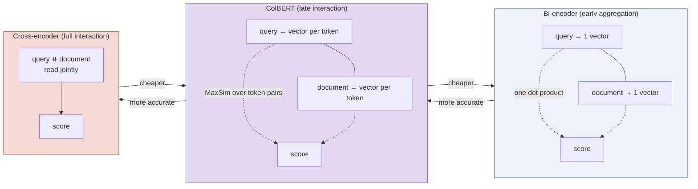
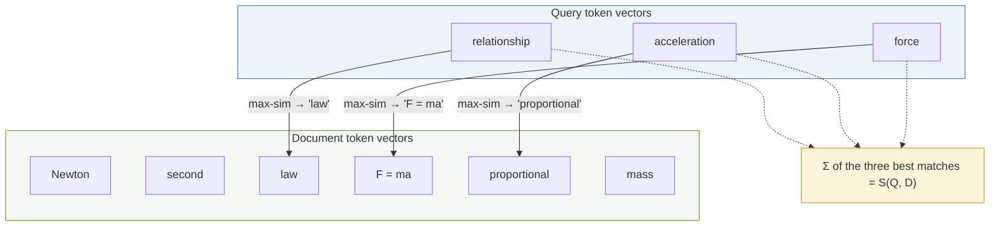
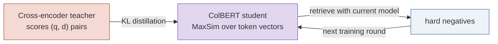

# ColBERT Embeddings and Late Interaction

*Concept guide for the retrieval-funnel lab. In the notebook: `colbert-ir/colbertv2.0` via `fastembed`'s `LateInteractionTextEmbedding`, used as the merge-and-rescore stage of the funnel.*

---

## 1. The Spectrum of Interaction

To understand ColBERT, place it between the two extremes of neural retrieval.

At one extreme sit **bi-encoders** (like the Matryoshka model in this lab): query and document are each compressed into a *single* vector, independently, and relevance is one dot product. Blazingly fast — all document vectors are precomputed and indexed — but the compression is brutal: an entire paragraph's meaning must survive being squeezed into one point in space. Word-level detail ("does the document actually address *acceleration*, or just physics generally?") is largely lost.

At the other extreme sit **cross-encoders**: query and document are concatenated and read *together* by a full transformer, every query token attending to every document token. Maximally accurate, but nothing can be precomputed — each candidate document costs a full forward pass at query time.

**ColBERT** (Khattab & Zaharia, 2020 — the name means *Contextualized Late Interaction over BERT*) is the deliberate middle point. It keeps a vector **per token** rather than per passage, and delays the query–document interaction until after both are encoded — hence *late* interaction:

## 2. How Scoring Works: MaxSim

ColBERT encodes the query into token vectors $\{q_1, \dots, q_n\}$ and the document into token vectors $\{d_1, \dots, d_m\}$ (128-dimensional in ColBERTv2, all unit-normalized). The relevance score is the **sum, over query tokens, of each query token's best match anywhere in the document**:

$$
S(Q, D) \;=\; \sum_{i=1}^{n} \; \max_{j=1..m} \; q_i^\top d_j
$$

Each query token independently "searches" the document for its most similar contextualized token, and the document is rewarded for covering *every* aspect of the query:

Why this is more accurate than single-vector matching:

- **No information bottleneck.** Nothing is averaged away — a long document keeps a vector for every token, so a passage that mentions the query's exact concept in one sentence is not diluted by everything else it discusses.
- **Fine-grained alignment.** Because the token vectors are *contextualized* (produced by a transformer that saw the whole passage), "bank" near "river" and "bank" near "loan" get different vectors — so MaxSim matches meanings, not strings.
- **Coverage semantics.** The sum-over-query-tokens structure means a document scores highly only if it has a good answer for *each* part of the query — closely mirroring how BM25 aggregates per-term evidence, but in semantic space.

Crucially, document token vectors are **precomputable and indexable**, and MaxSim is just dot products — no transformer runs over query–document pairs at query time. This is exactly the property the cross-encoder lacks.

## 3. How ColBERT Is Trained

ColBERT is trained end-to-end so that the *MaxSim score itself* ranks correctly — the encoder learns to produce token vectors that are good at late interaction.

**ColBERTv1** used a straightforward pairwise objective on MS MARCO: given a query with a relevant passage $d^+$ and an irrelevant one $d^-$, apply softmax cross-entropy over the pair of MaxSim scores so that $S(Q, d^+) > S(Q, d^-)$. Both encoders share one BERT backbone (with a `[Q]`/`[D]` marker token distinguishing the two roles), followed by a linear layer down to 128 dimensions and L2 normalization. Query token vectors are also computed once per query and reused against every candidate.

**ColBERTv2** (the checkpoint used in this lab) strengthened this recipe considerably:

1. **Distillation from a cross-encoder.** Instead of binary relevance labels, a powerful cross-encoder teacher (a MiniLM reranker) scores the training pairs, and ColBERT is trained with a KL-divergence loss to match the teacher's score *distribution* over one positive and many negatives. The gold-standard judge (see the [cross-encoder guide](cross_encoder_reranking.md)) thus transfers its precision into a model cheap enough to index.
2. **Hard negatives, mined in rounds.** The negatives are not random — they are retrieved by the model's own previous iteration, so training keeps focusing on the mistakes that still fool it.
3. **Residual compression.** Token vectors gravitate into clusters; v2 stores each vector as a cluster-centroid id plus a heavily quantized residual, cutting the index size ~6–10× — which matters, because storing a vector per token is ColBERT's main cost.

## 4. How the Lab Uses It

In the notebook, ColBERT is *not* used to search the whole corpus — that would require a multi-vector index over every token of every chunk. Instead:

- Each chunk's ColBERT token vectors are stored in Qdrant as a **multi-vector** named vector with the `MAX_SIM` comparator, and **HNSW is disabled** (`m=0`) for that vector space, because it will never be searched directly.
- At query time, the merged ~150 candidates from the dense (Matryoshka) and sparse (SPLADE) branches are **rescored** with MaxSim, and the top 50 survive. Qdrant performs this server-side: the ColBERT query vectors are the top-level `query` of `query_points`, and the other retrievers are `prefetch` branches.

This placement is the sweet spot: expensive enough that you don't run it corpus-wide, precise enough to meaningfully re-order the union of the two coarse branches — and it acts as a *common judge* that puts dense-retrieved and sparse-retrieved candidates on a single comparable scale before the final reranker.

## 5. Strengths and Costs at a Glance

| | Bi-encoder | ColBERT | Cross-encoder |
|---|---|---|---|
| Vectors stored per document | 1 | one per token (~dozens–hundreds) | none (no precomputation) |
| Query-time cost per candidate | 1 dot product | $n \times m$ dot products (MaxSim) | full transformer pass |
| Word-level query–document alignment | ✗ | ✓ | ✓ |
| Joint reasoning over the pair (negation, ordering) | ✗ | partial | ✓ |
| Typical funnel role | first-stage recall | mid-funnel rescoring | final reranking |

---

*References: Khattab & Zaharia, "ColBERT: Efficient and Effective Passage Search via Contextualized Late Interaction over BERT", SIGIR 2020 — [arxiv.org/abs/2004.12832](https://arxiv.org/abs/2004.12832); Santhanam et al., "ColBERTv2: Effective and Efficient Retrieval via Lightweight Late Interaction", NAACL 2022 — [arxiv.org/abs/2112.01488](https://arxiv.org/abs/2112.01488).*
