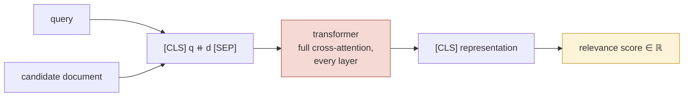
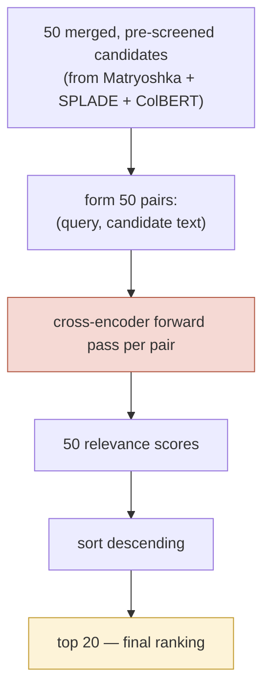

# Cross-Encoder Reranking

*Concept guide for the retrieval-funnel lab. In the notebook: `cross-encoder/ms-marco-MiniLM-L6-v2`, the final stage that reranks 50 candidates down to the top 20.*

---

## 1. What a Cross-Encoder Is

Every other model in this lab encodes the query and the document **separately** and compares the resulting vectors. A **cross-encoder** refuses to separate them. It concatenates the query and a candidate document into a single input —

```
[CLS] query tokens [SEP] document tokens [SEP]
```

— and runs one transformer over the pair, so that **every query token attends to every document token at every layer**. A small classification head on the `[CLS]` output emits a single number: a relevance score for *this query with this document*.



There is no "document embedding" anywhere in this picture — and that is both its superpower and its curse.

## 2. Why Cross-Encoders Are the Gold Standard

Because the two texts are processed *jointly from the first layer*, the model can perform genuinely relational reasoning that no independently-computed representation can:

- **Negation and polarity.** "treatments that do *not* involve antibiotics" — a bi-encoder's document vector was computed without knowing the query cares about the negation; a cross-encoder reads both together and can act on it.
- **Word order and role.** "Who defeated Napoleon" vs. "Who did Napoleon defeat" have nearly identical bags of concepts and very similar dense embeddings — but attention over the pair distinguishes subject from object.
- **Conditional emphasis.** Which aspect of a long document matters depends on the query. Independent encodings must commit to one fixed summary of the document; a cross-encoder effectively re-reads the document *in the light of* this particular query.
- **Exact detail checking.** Numbers, dates, entity names in the query can be verified against the document token by token.

Formally: a bi-encoder is constrained to scores of the form $s = f(q)^\top g(d)$ — the interaction happens only at the final dot product, through a fixed-size bottleneck. A cross-encoder computes $s = h(q, d)$ with no factorization constraint and no bottleneck. It is strictly more expressive, and empirically, on ranking benchmarks (MS MARCO, TREC, BEIR), a well-trained cross-encoder reliably tops the corresponding bi-encoder — which is why other retrieval models (ColBERTv2, SPLADE++ — both used in this lab) are themselves *trained by distilling a cross-encoder teacher*. The judge is so trusted that the rest of the field learns from its verdicts.

### Training

The checkpoint used here was trained on **MS MARCO** passage ranking: millions of real Bing queries, each with human-identified relevant passages and mined hard negatives. The model learns, via a binary relevance objective over (query, passage) pairs, to output high scores for relevant pairs and low for irrelevant ones — including the *nearly*-relevant hard negatives that first-stage retrievers confuse. MiniLM-L6 itself is a 6-layer distilled transformer, keeping per-pair inference in the low milliseconds.

## 3. The Cost — and Why It Dictates the Funnel Position

The expressiveness has a brutal price: **nothing can be precomputed.** The score depends jointly on query and document, so there is no document vector to index offline. Scoring $k$ candidates means $k$ full transformer forward passes *at query time*:

| | Bi-encoder / SPLADE / ColBERT | Cross-encoder |
|---|---|---|
| Offline precomputation | document vectors, indexed | none possible |
| Query-time cost for corpus of $N$ | ~$\log N$ (ANN) or sparse lookup | $N$ forward passes — infeasible |
| Query-time cost for $k$ candidates | $k$ cheap vector ops | $k$ forward passes — fine for small $k$ |

Scanning even this lab's modest corpus with a cross-encoder would mean thousands of transformer passes per query; a production corpus of millions would take minutes to hours. Restricted to the funnel's 50 survivors, it is tens of milliseconds. Hence the iron rule of retrieval-system design:

> **The cross-encoder comes last, and only ever sees a shortlist.** The earlier stages exist precisely to make its candidate set small enough to afford — and its job is not to *find* documents, but to put an already-good shortlist into precisely the right order.



This division of labor also reframes what "quality" means per stage: the early stages are measured by **recall** (is the right answer *somewhere* in the candidates?), the cross-encoder by **precision at the top** (is the right answer *first*?). Recall lost before the reranker is unrecoverable — the cross-encoder cannot rank what it never sees.

## 4. How the Lab Uses It

In the notebook, `cross_encoder_reranking()`:

1. takes the 50 candidates returned by Qdrant's hybrid search,
2. builds 50 `[query, chunk_text]` pairs,
3. scores them all with one batched `cross_encoder.predict()` call,
4. sorts by score and returns the top 20 (each result keeping both the cross-encoder `score` and the upstream Qdrant `distance` — instructive to compare!),

and `retrieve(query, use_cross_encoder=False)` lets you switch the reranker off to see, side by side, how much the final ordering improves. The performance-analysis section then times this stage against the entire hybrid search — typically revealing that the reranker, despite touching only 50 documents, accounts for a large share of total latency. That asymmetry *is* the lesson: precision is expensive, so you buy it only for the few documents that have earned it.

## 5. Practical Notes

- **Batch the pairs.** One `predict()` call on all pairs exploits GPU/MPS parallelism; looping pair-by-pair does not.
- **Scores are not probabilities** (this checkpoint outputs raw logits); they are comparable *within* one query's candidate list, which is all that ranking needs.
- **Truncation:** the pair must fit the model's input window (512 tokens here); very long chunks get truncated, which is one more argument for sane chunk sizes at ingestion.
- **Choosing $k$:** reranking 50 candidates to output 20 is this lab's setting; production systems commonly rerank 25–200 depending on the latency budget. Increasing $k$ buys recall into the reranker at linear cost.
- **Modern variants:** larger cross-encoders (e.g. BGE-reranker, monoT5, and LLM-as-reranker approaches) push accuracy further at proportionally higher cost — the architecture-independent principle stays the same: *joint encoding at the end of the funnel.*
