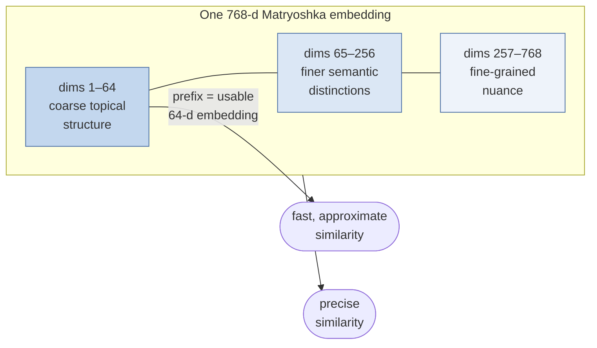
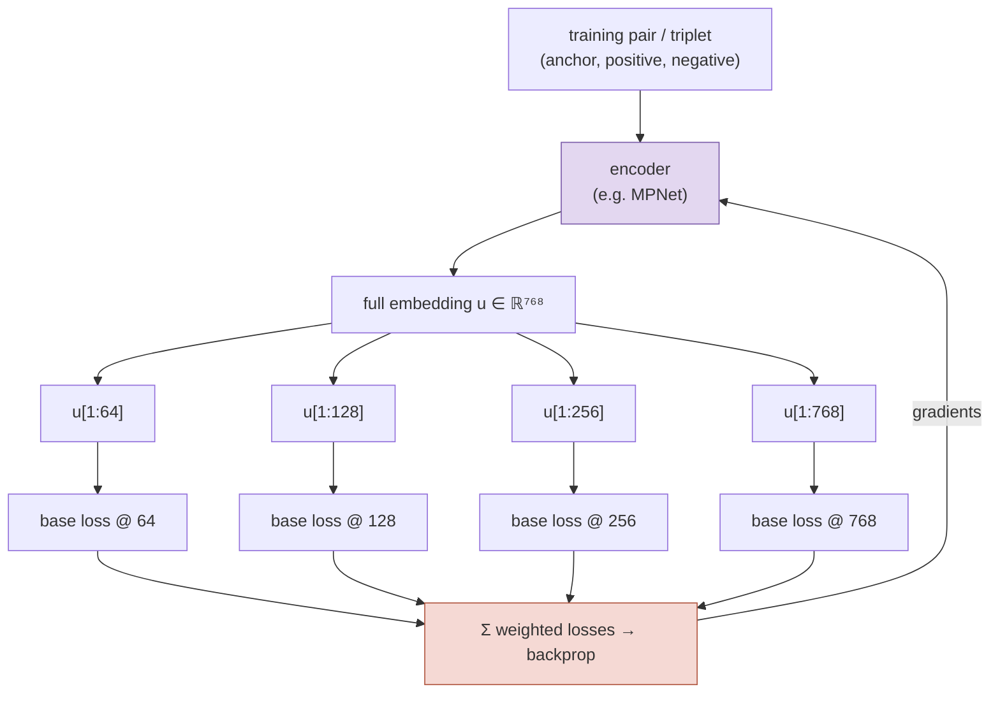
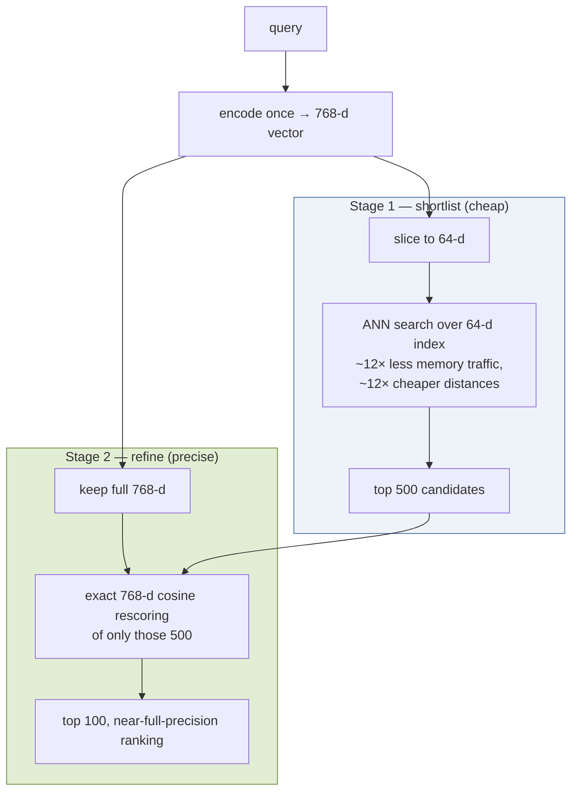

# Matryoshka Embeddings

*Concept guide for the retrieval-funnel lab. In the notebook: `tomaarsen/mpnet-base-nli-matryoshka`, used at both 64 and 768 dimensions.*

---

## 1. The Problem They Solve

A standard sentence embedding model produces vectors of a fixed dimension — say 768. Every use of that vector pays the full 768-dimensional price: storage is 768 floats per document, and every similarity computation during search costs a 768-dimensional dot product. For a first-stage retrieval that must scan millions of documents, this is expensive — and most of that precision is wasted, because a first stage only needs to be *roughly* right.

The obvious idea — just truncate the vector, keep the first 64 coordinates and drop the rest — fails for ordinary embeddings. Nothing in standard training encourages any particular coordinate to matter more than any other; the information is spread uniformly across all dimensions. Chop off 90% of the coordinates and you chop off roughly 90% of the information, and nearest-neighbor quality collapses.

**Matryoshka Representation Learning** (MRL, Kusupati et al., 2022) fixes this at *training time*: it trains the model so that the information is deliberately concentrated front-loaded — the first coordinates carry the coarsest, most important structure, and later coordinates add progressively finer detail. Like the Russian nesting dolls the technique is named after, every prefix of the vector is itself a complete, usable embedding — just at lower resolution:

## 2. How They Are Trained

The trick is disarmingly simple. Take whatever loss you would normally train the embedding model with — a contrastive loss, a triplet loss, a similarity-ranking loss — and instead of applying it once to the full vector, apply it **simultaneously to a whole family of truncated prefixes** of the same vector, and sum the results:

$$
\mathcal{L}_{\text{MRL}} \;=\; \sum_{m \,\in\, \mathcal{M}} w_m \cdot \mathcal{L}\big(f(x)_{[1:m]}\big),
\qquad \mathcal{M} = \{64, 128, 256, 512, 768\}
$$

where $f(x)_{[1:m]}$ is the embedding truncated to its first $m$ coordinates (re-normalized), and $w_m$ are optional per-dimension weights. In `sentence-transformers` this is exactly what `MatryoshkaLoss` does: it wraps a base loss (e.g. `MultipleNegativesRankingLoss` or `CoSENTLoss`) and evaluates it at every dimension in the list.

Because *every* prefix must independently succeed at the contrastive task, gradient descent has no choice but to organize the vector hierarchically:

- The **first 64 coordinates** are optimized in every single term of the sum, so they absorb the most broadly useful, coarse discriminative signal (in this lab's corpus: roughly "is this Biology, Physics, or History, and which broad topic within it?").
- **Later coordinates** appear only in the higher-dimensional loss terms, so they specialize in the residual fine detail that the earlier coordinates could not capture.

The result is a *coarse-to-fine* ordering of dimensions — an embedding-space analogue of progressive JPEG rendering. Notably, this costs almost nothing extra at training time (the encoder forward pass is shared; only the cheap loss heads multiply) and *nothing* at inference time: the model emits one 768-d vector, and you simply slice it to whatever length you need.

## 3. Why This Enables Coarse-to-Fine Retrieval

The payoff is the two-stage dense retrieval pattern used in the notebook, sometimes called *funnel retrieval* or *adaptive retrieval*:

The arithmetic is what makes this compelling. Searching the corpus at 64-d instead of 768-d cuts the per-comparison cost and the index memory footprint by ~12×, which also improves cache behavior inside the ANN index (HNSW traversals are memory-bandwidth-bound). The 64-d ranking is not perfect — but it does not have to be: it only needs the true best documents to land *somewhere in the top 500*. Stage 2 then rescores those 500 with the full 768-d vectors — a trivial amount of work — and recovers essentially the full-dimensional ranking quality.

In the notebook, both stages even live inside Qdrant as a single nested `prefetch`: the `matryoshka_64` named vector produces 500 candidates, and the `matryoshka_768` named vector rescores them down to 100 — one round trip, two resolutions of the *same* underlying embedding.

## 4. Practical Notes

- **One model, two views.** The notebook loads the same checkpoint twice — once as-is (768-d) and once with `truncate_dim=64`. There are not two models; the 64-d encoder just slices (and re-normalizes) the same output. Documents are stored under both named vectors so each stage has the resolution it needs.
- **Re-normalize after truncating.** Cosine similarity assumes unit norm; a truncated prefix of a unit vector is no longer unit-length. `truncate_dim` handles this for you.
- **Choose the truncation from the data.** 64 is not magic — the MRL paper trains at {8, 16, …, 2048} and quality degrades gracefully. The right stage-1 dimension is the smallest one whose recall@500 (against the full-dimension ranking) is still near 1.0 for your corpus.
- **This must be trained in — you cannot truncate an ordinary embedding model.** If a model was not trained with Matryoshka-style loss, its truncated prefixes are essentially arbitrary projections. Many recent embedding APIs (e.g. models offering a `dimensions` parameter) are Matryoshka-trained under the hood.

## 5. Where It Sits in the Funnel

Matryoshka embeddings own the **wide mouth of the funnel**: the only stage that confronts the entire corpus. Their job is not to produce the final ranking — it is to guarantee, as cheaply as possible, that everything relevant survives into the narrower stages, where SPLADE's lexical candidates join them and ColBERT and the cross-encoder do the precise ordering.

---

*Reference: Kusupati et al., "Matryoshka Representation Learning", NeurIPS 2022 — [arxiv.org/abs/2205.13147](https://arxiv.org/abs/2205.13147).*
