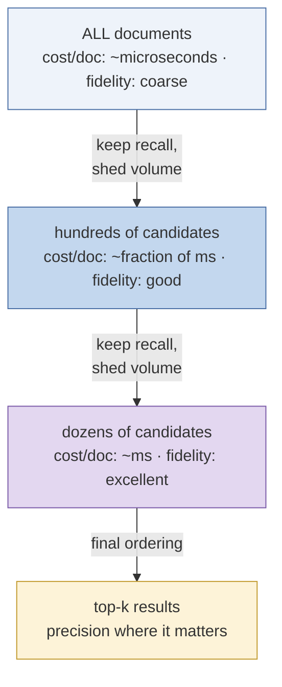
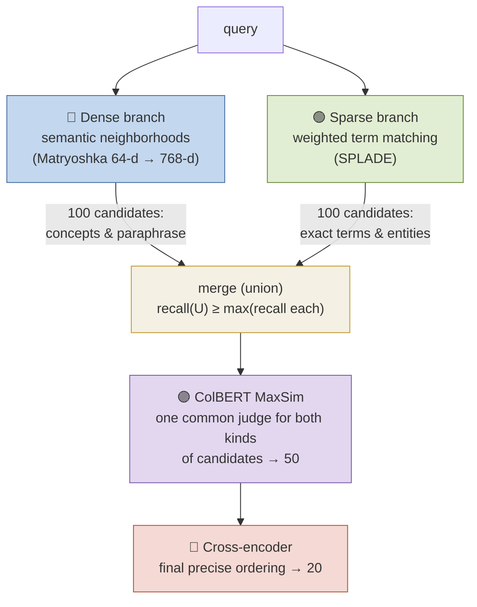
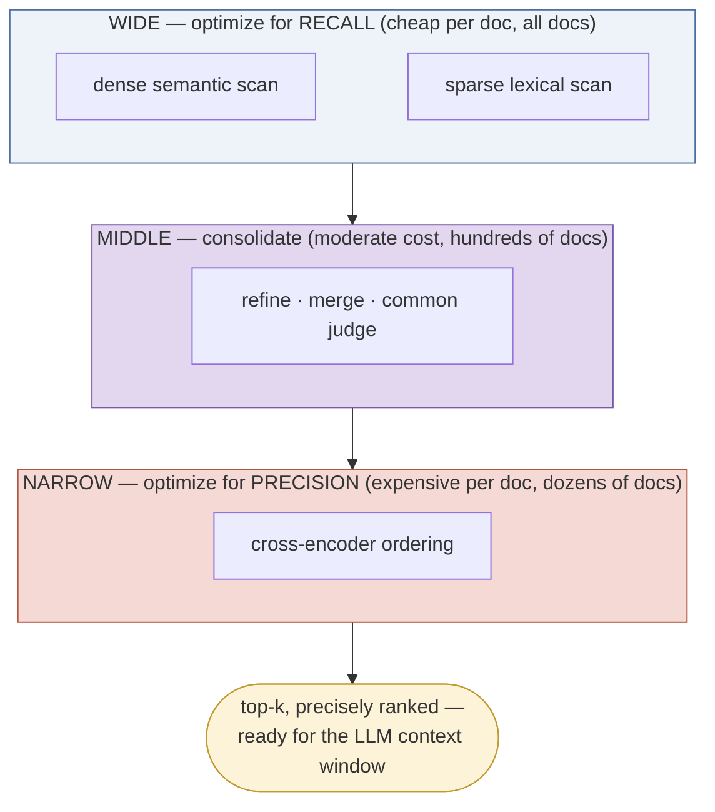

# The Retrieval Funnel Philosophy

*Concept guide for the retrieval-funnel lab: why modern retrieval is staged as a funnel, and why the funnel's mouth runs keyword search and semantic search in parallel before merging and reranking.*

---

## 1. The Fundamental Tension: Recall vs. Precision vs. Cost

A retrieval system faces three demands that no single algorithm satisfies at once:

- **Recall** — the relevant documents must be *found*, somewhere in the candidate set.
- **Precision** — the top of the final list must be *right*; in a RAG system, only a handful of chunks fit into the LLM's context.
- **Cost** — answers must come back in tens of milliseconds, over corpora of millions of documents.

The scorers available to us line up on a spectrum: the cheap ones (single-vector cosine, sparse dot products) can scan everything but rank imperfectly; the accurate ones (late interaction, cross-encoders) rank superbly but cannot possibly scan everything. The funnel is the architectural resolution of this tension:

> **Spend almost nothing per document on all documents; spend a lot per document on almost no documents.**

Each stage's only obligation is to *not lose* the relevant documents while shrinking the pool enough that the next, more expensive stage becomes affordable. Precision is progressively purchased; recall must be protected from the very first stage — because **recall lost early is unrecoverable**. No later stage, however brilliant, can rank a document it never received.

This is the same design that ranks your social feed, your search-engine results page, and your product recommendations: a *candidate generation* layer, one or more *lightweight ranking* layers, and a *heavyweight reranking* layer. The notebook's pipeline is a faithful miniature of that industrial pattern.

## 2. Why the Mouth of the Funnel Must Be Two-Eyed

The subtler question is not *why stages*, but why the first stage is **two parallel retrievers** — dense (semantic) *and* sparse (keyword) — rather than one. The answer: the two families have **complementary, non-overlapping failure modes**, and a funnel's first stage is the one place where a miss is fatal.

**Dense retrieval** (Matryoshka embeddings here) maps texts to points in a semantic space. It finds paraphrases and conceptual matches even with zero shared vocabulary — "How do our bodies fight infection after a shot?" happily lands near a passage about vaccine-induced immunity. But compression into one vector blurs specifics: rare proper nouns, product codes, equations, exact quotes, and out-of-training-distribution jargon all get flattened into their topical neighborhood. The document that says exactly `"Treaty of Küçük Kaynarca"` may lose, in cosine similarity, to ten generic passages about Ottoman diplomacy.

**Sparse retrieval** (SPLADE here; BM25 classically) matches weighted terms. It is deadly accurate on exact terminology, identifiers, names, and numbers — and completely blind to a relevant document that shares no (expanded) vocabulary with the query.

| Query characteristic | Dense branch | Sparse branch |
|---|---|---|
| Paraphrase, no shared words | ✓ finds it | ✗ misses |
| Rare entity / exact identifier / quote | ✗ blurs it | ✓ nails it |
| Conceptual question ("why does inflation hurt savers?") | ✓ | weak |
| Jargon-heavy domain query | hit-or-miss | ✓ (terms match literally) |
| Misspelled / vocabulary-mismatched keywords | ✓ tolerant | SPLADE partially (expansion); BM25 ✗ |

Since each branch reliably catches what the other reliably drops, the *union* of their candidate sets has strictly higher recall than either alone — usually dramatically so on real query mixes. Running them in parallel costs little (both are cheap by construction), and the price of the union — a merged pool containing false positives and duplicates — is exactly what the downstream precision stages are built to clean up.

## 3. The Merge Problem — and Why Reranking Solves It

Merging creates a puzzle the parallel branches cannot solve themselves: **their scores are incomparable.** A cosine similarity of 0.83 from the dense branch and a SPLADE dot product of 11.6 live on different scales with different meanings; you cannot sort the union by "score". There are two standard resolutions:

1. **Rank-based fusion** (e.g. Reciprocal Rank Fusion): ignore scores, combine ranks — $\text{RRF}(d) = \sum_b \frac{1}{k + \text{rank}_b(d)}$. Cheap, robust, no model needed; but it only reshuffles existing opinions, adding no new evidence.
2. **Rescoring with a stronger common judge** — the notebook's choice. Every merged candidate, whichever branch produced it, is re-evaluated from scratch by ColBERT's late interaction, then by the cross-encoder. The branches' scores are used only *within* each branch (to pick its top 100); across branches, a single consistent scale takes over.

This is why "merge **and rerank**" is one phrase in the funnel philosophy, not two: a merged pool without a common judge is just a pile. Reranking is what turns the union's extra *recall* into extra *precision at the top*.

## 4. The Full Design Logic, Stage by Stage

Reading the notebook's pipeline through this lens, every design choice becomes a corollary of one principle — *per-document cost may rise only as document count falls, and recall must be protected until precision takes over*:

| Stage | Pool size | Why this scorer, here |
|---|---|---|
| Matryoshka 64-d ANN | corpus → 500 | the only stage that faces the whole corpus, so it uses the cheapest faithful signal available — a truncated prefix of the dense vector |
| Matryoshka 768-d rescore | 500 → 100 | same model at full resolution: recovers the precision the truncation gave up, for pennies, on 500 docs only |
| SPLADE (parallel) | corpus → 100 | the lexical safety net; inverted-index cheap, so it can afford the whole corpus too |
| Merge + ColBERT MaxSim | ~150–200 → 50 | a single token-level judge puts both branches on one scale; too costly for the corpus, trivial for 200 |
| Cross-encoder | 50 → 20 | the gold standard, affordable only now; converts a good shortlist into a *correctly ordered* one |

Three practical maxims fall out of this, worth carrying into any retrieval system you build:

- **Tune early stages for recall, late stages for precision.** Measure recall@N at each funnel boundary; a funnel is only as good as its leakiest stage.
- **Widen a stage before blaming the next one.** If good answers are missing at the end, the usual culprit is a too-narrow early limit, not the reranker.
- **Hybrid is the default, not the exotic option.** Production search at every major deployment pairs lexical and semantic candidate generation — because query traffic always mixes both kinds of information need.

## 5. One Last Look at the Funnel

The funnel is not a specific set of models — Matryoshka, SPLADE, ColBERT, and MiniLM are this lab's cast, not the concept. It is a *discipline*: know what each scorer can see and what it costs, order them so cost rises only as volume falls, protect recall at the wide end with complementary retrievers, and spend your precision budget only where it changes the answer.
