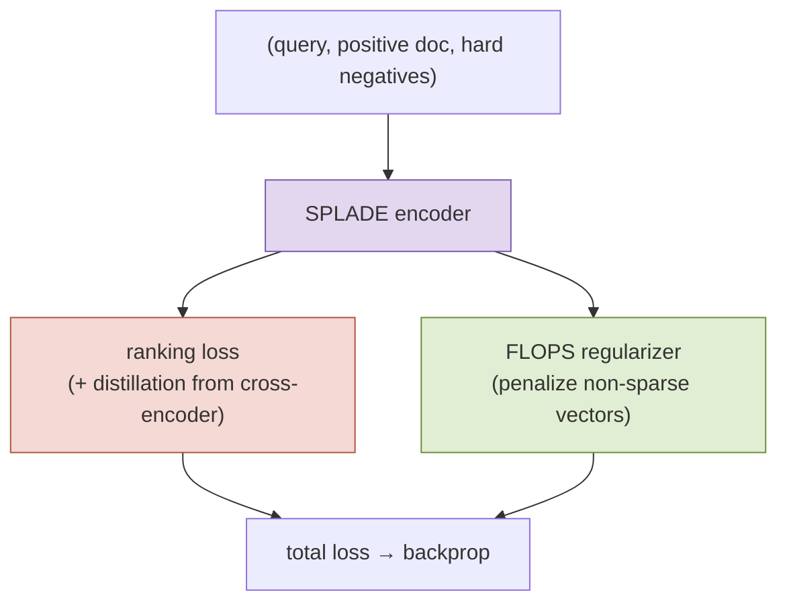
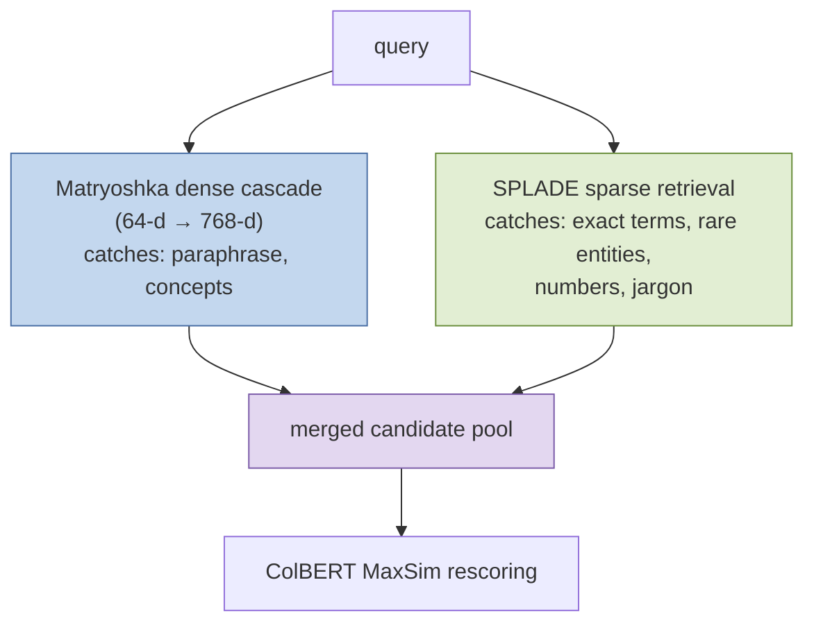

# SPLADE Embeddings: Learned Sparse Retrieval

*Concept guide for the retrieval-funnel lab. In the notebook: `prithivida/Splade_PP_en_v1` via `fastembed`'s `SparseTextEmbedding`, feeding the sparse branch of the hybrid search.*

---

## 1. What SPLADE Is

**SPLADE** (*SParse Lexical AnD Expansion model*, Formal et al., 2021) is a neural model that produces **sparse** vectors: instead of a dense 768-dimensional point, each text becomes a vector over the model's entire vocabulary (~30,000 WordPiece terms) in which almost all entries are zero. Each non-zero entry means *"this term is relevant to this text, with this learned importance weight."*

That makes SPLADE the same *shape* as classical keyword retrieval — a bag of weighted terms, searchable with an inverted index — but with two crucial neural upgrades:

1. **Learned term weighting.** Instead of BM25's fixed statistical formula (term frequency × inverse document frequency, with length normalization), a transformer decides how important each term is *in context*.
2. **Term expansion.** The vector can contain terms that do **not appear in the text at all**. A chunk about "vaccines" may light up `immunization`, `antibody`, `dose`; a query about "car" may light up `automobile`. The model learns to bridge vocabulary mismatch — the classic failure mode of exact-match retrieval.

```mermaid
flowchart LR
    T["'How do vaccines work<br/>in the human body?'"] --> M["SPLADE encoder<br/>(BERT + MLM head)"]
    M --> V["sparse vector over vocabulary"]
    subgraph V2["non-zero entries (illustrative)"]
        direction TB
        w1["vaccine : 2.9"]
        w2["immune : 2.1"]
        w3["body : 1.4"]
        w4["antibody : 1.2  ← expansion"]
        w5["dose : 0.7  ← expansion"]
        w6["how : 0.1"]
    end
    V --- V2
    V2 --> IDX[("inverted index /<br/>Qdrant sparse vectors")]

    style M fill:#e3d7f0,stroke:#7a5aa8
    style V2 fill:#e2eed3,stroke:#6b8f3e
    style IDX fill:#fdf3d8,stroke:#c19a2e
```

Relevance between a query and document is then just a **dot product of two sparse vectors** — computable with the same inverted-index machinery that has powered search engines for decades, touching only documents that share at least one term with the query.

## 2. How the Vector Is Produced

SPLADE reuses BERT's **masked-language-model (MLM) head** — the part of BERT pretrained to predict vocabulary words — in a clever way. For each token position $i$ in the input, the MLM head emits a logit $w_{ij}$ for every vocabulary term $j$. SPLADE aggregates these into one score per vocabulary term:

$$
s_j \;=\; \max_{i \in \text{tokens}} \; \log\!\big(1 + \mathrm{ReLU}(w_{ij})\big)
$$

- **ReLU** keeps only positive evidence (a term is either supported or it isn't — no negative weights, which keeps the vector sparse and index-friendly).
- **log(1 + ·)** dampens extreme weights, echoing the saturating term-frequency curve of BM25.
- **max over positions** means a term is included if *any* part of the text supports it strongly.

Because the MLM head was pretrained to know which words fit a context, it naturally scores synonyms and related terms — that is where expansion comes from, for free.

### Training

SPLADE is trained like a dense retriever — contrastive ranking loss on (query, positive, negatives) triples, with in-batch and hard negatives, and in later variants (including the `Splade_PP` / SPLADE++ family used here) **distillation from a cross-encoder teacher**. The distinctive extra ingredient is a **sparsity regularizer**: the FLOPS loss, which penalizes the expected number of floating-point operations the vector will cause at query time, pushing the model to keep only the terms that pay their way.

$$
\mathcal{L} \;=\; \mathcal{L}_{\text{rank}} \;+\; \lambda_q \,\mathcal{L}_{\text{FLOPS}}(\text{queries}) \;+\; \lambda_d \,\mathcal{L}_{\text{FLOPS}}(\text{docs})
$$

The two $\lambda$s directly trade effectiveness against index size and latency — turning sparsity into a tunable dial rather than a fixed property.

## 3. Why SPLADE Is Often Superior to BM25

BM25 is a formidable baseline — decades of information-retrieval research distilled into one robust formula. SPLADE keeps everything that makes BM25 strong (exact matching, inverted-index efficiency, interpretable term weights) while removing its two structural blind spots:

| | BM25 | SPLADE |
|---|---|---|
| Term weights | fixed statistical formula (tf–idf–length) | learned, context-dependent |
| Vocabulary mismatch ("car" vs "automobile") | hard failure — no shared term, no match | handled via learned expansion |
| Term importance in context | same weight for a word wherever it appears | disambiguated by the transformer ("bank" scores differently by context) |
| Multi-word semantics | none (bag of words) | partially captured through contextual weighting |
| Tuning to a domain / task | corpus statistics only | trainable end-to-end on relevance data |
| Infrastructure | inverted index | the same inverted index (or Qdrant sparse vectors) |

Concretely, on in-domain benchmarks (MS MARCO) SPLADE outperforms BM25 by a wide margin, and — unusually for neural retrievers — it also *generalizes well out of domain* (BEIR benchmark), where many dense retrievers fall behind BM25. It occupies a genuine sweet spot: neural understanding with lexical-search robustness.

Two honest caveats keep the comparison fair: SPLADE requires a GPU-ish encoder pass at indexing time (BM25 needs none), and its expansions can occasionally introduce topical drift that BM25's literal matching would never produce. In practice, on specialized corpora BM25 sometimes remains competitive — which is why hybrid systems, not either extreme, are the production norm.

## 4. Role in the Funnel: The Lexical Safety Net

In the notebook's pipeline, SPLADE runs as the **parallel sparse branch** of the hybrid search — a Qdrant `Prefetch` over the `splade` sparse named vector (stored with the IDF modifier), retrieving 100 candidates independently of the dense Matryoshka cascade:

The two branches fail differently, which is precisely why both exist. A dense embedding can blur a rare proper noun, an equation, or a domain-specific term into its topical neighborhood ("Treaty of Westphalia" → generic European-history space); SPLADE will match it exactly — and weight it heavily, since rare terms earn high learned weights. Conversely, a query phrased with none of the document's words sails through the dense branch and would miss a purely lexical one. The funnel does not have to choose: it merges both candidate sets and lets ColBERT — and ultimately the cross-encoder — sort out the union. See the [retrieval-funnel philosophy](retrieval_funnel_philosophy.md) guide for the recall arithmetic behind this.

---

*References: Formal, Piwowarski & Clinchant, "SPLADE: Sparse Lexical and Expansion Model for First Stage Ranking", SIGIR 2021 — [arxiv.org/abs/2107.05720](https://arxiv.org/abs/2107.05720); Formal et al., "SPLADE v2 / SPLADE++" — [arxiv.org/abs/2109.10086](https://arxiv.org/abs/2109.10086).*
